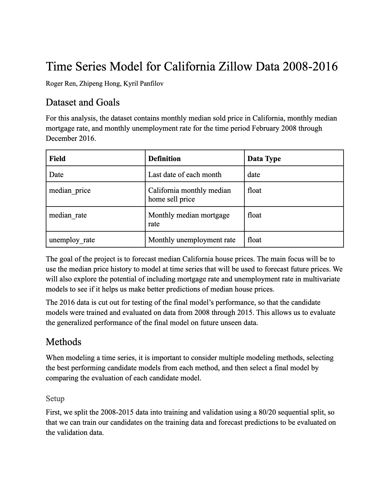

# California Median House Price Prediction 

## Goal of the Project 
The goal of this project is to construct a time series analysis and model (univariate or multivariate) for forecasting the monthly median sold price for Jan-Dec 2016.

Data Source: The Zillow dataset (modified) recorded Feb 2008- Dec 2015 monthly median sold price for housing in California, Feb 2008-Dec 2016 monthly median mortgage rate, and Feb 2008-Dec 2016 monthly unemployment rate.

## Methods
When modeling a time series, it is important to consider multiple modeling methods, selecting the best performing candidate models from each method, and then select a final model by comparing the evaluation of each candidate model.

## Report
Check it out! [Report](https://github.com/hongjungg666/California-median-house-price-prediction_TS/blob/master/Time%20Series%20Final%20Project%20Report.pdf)

## Code Notebook
[Modeling part](https://github.com/hongjungg666/California-median-house-price-prediction_TS/blob/master/House_Prediction.ipynb)
